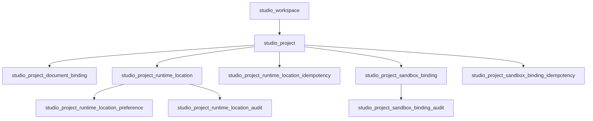

# BirdCoder Workbench Database

This module is the only BirdCoder persistence authority. It owns exactly 10 coding-workbench
tables with the `studio_` prefix. The machine authorities are
`contract/table-registry.json`, `contract/schema.yaml`, and the greenfield SQLite/PostgreSQL
baselines under `ddl/baseline/`.

## Table Catalog

| Table | Aggregate role | Responsibility |
| --- | --- | --- |
| `studio_workspace` | Workspace root | Tenant- and organization-scoped workspace identity, display metadata, visibility, lifecycle, ownership, and optimistic version. |
| `studio_project` | Project root | Project identity and lifecycle within one workspace; stores only the opaque canonical Agents project reference. |
| `studio_project_document_binding` | Project child | Binds a project to an opaque Documents `documentId`; document title, body, status, and versions remain in Documents. |
| `studio_project_runtime_location` | Project child | Verified execution location, encrypted absolute path, path fingerprint, target kind, capability flags, health, and last verification facts. |
| `studio_project_runtime_location_preference` | Project child | Selects one runtime location per user and capability (`terminal`, `git`, `build`, or `filesystem`). |
| `studio_project_runtime_location_idempotency` | Runtime-location support | Bounded replay protection for runtime-location commands using hashed keys and request fingerprints. |
| `studio_project_runtime_location_audit` | Runtime-location evidence | Append-only, redacted security evidence for runtime-location registration, update, verification, rebind, revoke, and failure outcomes. |
| `studio_project_sandbox_binding` | Project child | One active Drive Sandbox binding per project, identified by opaque sandbox/root entry ids and a traversal-safe logical path. |
| `studio_project_sandbox_binding_idempotency` | Sandbox support | Bounded replay protection for sandbox-binding mutations using hashed keys and request fingerprints. |
| `studio_project_sandbox_binding_audit` | Sandbox evidence | Append-only, redacted security evidence for sandbox-binding mutations and rejected or failed attempts. |

## Relationship Model



Only BirdCoder-owned relationships use physical foreign keys. References to sdkwork-agents, Documents,
Drive, IAM subjects, and runtime targets are opaque identifiers validated at service/SDK
boundaries; this database does not reproduce those modules' tables or foreign keys.

## Invariants

- Runtime business rows use application-preallocated `BIGINT` primary keys; public aggregate and
  binding resources also carry unique UUIDs.
- Business rows are scoped by `tenant_id` and `organization_id`. Repository predicates must apply
  both scope values before lifecycle or pagination filters.
- Aggregate and binding rows use optimistic `version` fields and soft deletion. Partial unique
  indexes enforce uniqueness only for active rows.
- Runtime paths are encrypted before persistence. Only a SHA-256 fingerprint is indexed; plaintext
  paths, credentials, tokens, and provider payloads are forbidden.
- Audit metadata is redacted before persistence and must remain a JSON object. Idempotency rows
  retain hashes and resource references only.
- Idempotency rows expire after seven days. Audit evidence is retained for 730 days and archived
  after 180 days according to `contract/retention-policy.yaml`.
- SQLite and PostgreSQL baselines express the same logical schema, constraints, indexes, enum
  checks, and lifecycle behavior.
- Persistent projections, mirrors, dual writes, local AI transcripts, and local Session/Message
  repositories are forbidden.

## Excluded Domains

sdkwork-agents Sessions and Session Items, Skills, saved Prompts, human IM (`sdkwork-im`), IAM collaboration, Documents
content, Appstore templates, Deployments, model settings, membership, orders, invoices, payments,
and notifications stay in their owning projects. This repository stores only the minimal opaque
references needed by BirdCoder workbench aggregates.

## Lifecycle

BirdCoder is pre-launch, so each supported engine has one greenfield baseline:

- `ddl/baseline/sqlite/0001_birdcoder_baseline.sql`
- `ddl/baseline/postgres/0001_birdcoder_baseline.sql`

The migration directories are reserved for changes after the first production release. Generated
DDL under `ddl/generated/` is derived and must not be edited by hand.

## Verification

```bash
pnpm db:materialize:contract
pnpm db:generate:ddl
pnpm db:validate
pnpm db:plan
pnpm db:init
pnpm db:drift:check
node scripts/domain-ownership-contract.test.mjs --report
```
