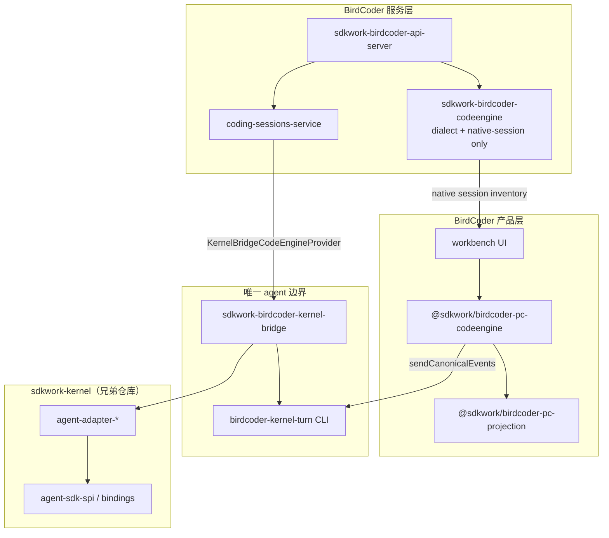

> Migrated from `docs/架构/31-Kernel-BirdCoder-集成实施方案.md` on 2026-06-24.
> Owner: SDKWork maintainers

## 1. 文档定位

本文是《30-Kernel-BirdCoder-职责边界标准》的**实施方案**：描述已落地的集成拓扑、关键文件、数据流与分阶段交付。机器可读的任务状态见 `specs/kernel-birdcoder-alignment.spec.json`；人工核对清单见《32-Kernel-BirdCoder-对齐验收与核对清单》。

权威标准仍来自 `../sdkwork-specs/`；本文不得与之冲突。

## 2. 设计原则（变与不变）

| 维度 | 不变（kernel 拥有） | 不变（BirdCoder 拥有） |
| --- | --- | --- |
| Agent 执行 | turn、model、tool、policy、官方 SDK binding | — |
| 产品投影 | — | `coding_session*`、`coding-server` API、workbench UI |
| 引擎目录 | binding 协商、adapter 实现 | descriptor、model catalog、access plan |
| 会话清单 | — | native-session catalog、dialect 归一化 |

**唯一集成边界**：`sdkwork-birdcoder-kernel-bridge`（Rust）+ `@sdkwork/birdcoder-pc-codeengine` 的 `kernelRuntime.ts`（TS 子进程调用）。

## 3. 集成拓扑



## 4. 分层与关键文件

### 4.1 Rust：kernel-bridge

| 文件 | 职责 |
| --- | --- |
| `crates/sdkwork-birdcoder-kernel-bridge/src/host.rs` | `BirdcoderKernelHost::bootstrap()`，四引擎 slot |
| `crates/sdkwork-birdcoder-kernel-bridge/src/engine_registry.rs` | `bootstrap_kernel_slot()`，binding id 映射 |
| `crates/sdkwork-birdcoder-kernel-bridge/src/turn_executor.rs` | `execute_kernel_turn()` → `ModelProvider.invoke` |
| `crates/sdkwork-birdcoder-kernel-bridge/src/live_interaction.rs` | live approval / user-question 路由（OpenCode → kernel bridge 边界） |
| `crates/sdkwork-birdcoder-kernel-bridge/src/boundaries.rs` | `KERNEL_OWNED_*` / `BIRDCODER_OWNED_*` 能力表 |
| `crates/sdkwork-birdcoder-kernel-bridge/src/bin/kernel_turn.rs` | JSON stdin → turn result stdout（TS 子进程） |

### 4.2 Rust：api-server 接线

| 文件 | 职责 |
| --- | --- |
| `crates/sdkwork-birdcoder-api-server/src/bootstrap/adapters.rs` | `KernelBridgeCodeEngineProvider` 实现 `CodeEngineProvider` |

已退役：`RegistryCodeEngineProvider`、codeengine 内 agent turn lane。

### 4.3 Rust：codeengine（瘦身保留）

| 模块 | 保留原因 |
| --- | --- |
| `codeengine_dialect` | BirdCoder 统一 tool/status 方言 |
| `catalog` / `native_session*` | 引擎 descriptor 与 native session 目录 |
| `*_provider.rs` | **仅** `NativeSessionProviderPlugin`（清单/详情） |
| `sdk_bridge.rs` | **仅** 持久化会话目录读取（`list/get`），无 turn 执行 |
| `codex.rs` / `opencode.rs` | CLI/HTTP 传输辅助（终端 resume、OpenCode catalog） |

### 4.4 TypeScript

| 文件 | 职责 |
| --- | --- |
| `apps/.../sdkwork-birdcoder-pc-codeengine/src/kernelRuntime.ts` | `birdcoder-kernel-turn` + `sendCanonicalEvents()` |
| `apps/.../sdkwork-birdcoder-pc-codeengine/src/runtime.ts` | canonical 包装；有 `sendCanonicalEvents` 时直通 |
| `apps/.../sdkwork-birdcoder-pc-projection/` | transcript、dialect re-export、providerAdapter（浏览器安全） |

已退役：`@sdkwork/birdcoder-pc-chat*`、`scripts/codeengine-official-sdk-bridge.ts`。

## 5. Turn 数据流

### 5.1 浏览器 / 桌面（TS）

1. UI 调用 `createChatEngineById(engineId)` → `kernelRuntime.ts`
2. `sendCanonicalEvents(messages, options)` 组装 `CodeEngineTurnRequestRecord`（含 `config`）
3. `execFileSync(birdcoder-kernel-turn)` 传入 JSON
4. 解析 `assistantContent`，发射 canonical events（`session.started` → `turn.completed`）

### 5.2 coding-server（Rust）

1. `coding-sessions-service` 调用 `CodeEngineProvider::execute_turn`
2. `KernelBridgeCodeEngineProvider` 在 `spawn_blocking` 中调用 `BirdcoderKernelHost::execute_turn`
3. 结果经 `build_succeeded_coding_session_turn_events` 投影为 `coding_session_event`

### 5.3 请求载荷（对齐 `CodeEngineTurnRequestRecord`）

```json
{
  "engineId": "codex",
  "modelId": "gpt-5.4",
  "requestKind": "user_message",
  "inputSummary": "…transcript…",
  "nativeSessionId": null,
  "config": {
    "ephemeral": false,
    "fullAuto": false,
    "skipGitRepoCheck": false
  }
}
```

## 6. sdkwork-kernel 生产化路线

以下在 **sdkwork-kernel** 仓库推进（BirdCoder 通过 bridge 消费，不重复实现）：

| 任务 ID | 内容 | 状态 |
| --- | --- | --- |
| KBA-K-01 | 四引擎 `sdk_integration` + `sdk-binding.manifest.json` | done |
| KBA-K-02 | release/profile=prod 时 mock `ModelProvider` fail-closed | done |
| KBA-K-03 | `SdkRuntimeBackedModelProvider` 路由真实 SDK（非 inner mock） | done |
| KBA-K-04 | `KERNEL_PRODUCT_PROJECTION_SPEC`：KernelEvent → `coding_session_event` | done |

生产 profile 下 mock/stub 已 fail-closed；真实官方 SDK 经 `engine-sdk-live.mjs`（`mode=sdk_live`）接通。

## 7. BirdCoder 侧剩余项

| 任务 ID | 内容 | 状态 |
| --- | --- | --- |
| KBA-BC-07 | OpenCode live approval/question 迁入 kernel bridge | done |

过渡：`opencode_provider` 仅保留 native session catalog；live reply 由 `kernel-bridge/live_interaction.rs` 路由。

## 8. 契约与门禁

| 命令 | 用途 |
| --- | --- |
| `pnpm run check:kernel-birdcoder-alignment` | 读取 alignment spec，核对证据与 gate 任务 |
| `pnpm run test:birdcoder-kernel-integration-contract` | bridge crate + workflow + kernel bindings |
| `pnpm run test:engine-runtime-adapter` | `kernel-runtime-adapter-contract`（历史脚本名保留） |
| `cargo test -p sdkwork-birdcoder-kernel-bridge` | Rust 单元测试 |

完整循环见《32》与 `docs/prompts/反复执行Kernel对齐指令.md`。

## 9. 相关文档

- [30-职责边界标准](./30-Kernel-BirdCoder-职责边界标准.md)
- [32-对齐验收与核对清单](./32-Kernel-BirdCoder-对齐验收与核对清单.md)
- [05-统一Kernel与Code Engine标准](./05-统一Kernel与Code%20Engine标准.md)
- [engine-sdk-integration 参考](../reference/engine-sdk-integration.md)
- [反复执行Kernel对齐指令](../prompts/反复执行Kernel对齐指令.md)

