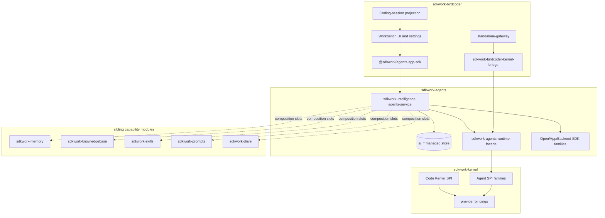

# TECH-36 Three-Layer Agent Platform Standard

Status: active
Owner: SDKWork maintainers
Updated: 2026-07-08
Specs: `AGENT_KERNEL_SPEC.md`, `AGENTS_KERNEL_BOUNDARY_SPEC.md`, `API_SPEC.md`, `SDK_SPEC.md`, `APP_SDK_INTEGRATION_SPEC.md`, `COMPONENT_SPEC.md`
Parent: [TECH_ARCHITECTURE.md](TECH_ARCHITECTURE.md)
PRD: [PRD-02-three-layer-agent-platform.md](../../product/prd/PRD-02-three-layer-agent-platform.md)

## 1. Objective

This document is the technical baseline for the `sdkwork-kernel -> sdkwork-agents -> sdkwork-birdcoder` agent platform. It freezes the dependency direction, SPI/API ownership, provider maturity model, and commercial-readiness gaps for BirdCoder.

The standard exists to prevent three failure modes:

- Product code directly importing kernel/provider internals.
- Business API and database semantics leaking into `sdkwork-kernel`.
- Stale documentation claiming missing APIs or wrong operation counts after `sdkwork-agents` evolved.

## 2. Architecture Overview



## 3. Mandatory Dependency Direction

```text
sdkwork-birdcoder
  -> sdkwork-agents-runtime-facade (Rust in-process execution boundary)
  -> @sdkwork/agents-app-sdk (TypeScript app-side business API)
  -> forbidden: sdkwork-agent-kernel, sdkwork-agent-provider-*

sdkwork-agents
  -> sdkwork-agents-runtime-facade
  -> sdkwork-kernel provider/internal bindings
  -> forbidden: BirdCoder product packages

sdkwork-kernel
  -> no product or agents business crate dependency
```

BirdCoder services and UI must use injected SDK clients or service ports. They must not construct raw HTTP calls, manual auth headers, local DTO forks, or generated-transport imports for agents app-api.

## 4. Kernel SPI Coverage And Gaps

Kernel follows a Linux-kernel-style model: stable SPI, pluggable providers, protocol adapters, and fail-closed execution when a binding is not production-ready.

| SPI Family | Kernel Responsibility | Current Product Relationship |
| --- | --- | --- |
| Model | model chat/stream abstractions and provider invocation | P0 code agents through runtime facade |
| Tool | tool calls, tool results, tool policy | projected into BirdCoder coding-session events |
| MCP | MCP server/client/tool integration | agents app API exposes marketplace projection |
| Skill | skill execution/provider hooks | composition slot to `sdkwork-skills` |
| Knowledge | retrieval/context provider hooks | composition slot to `sdkwork-knowledgebase` |
| Context/Memory | bounded runtime context and memory semantics | durable implementation belongs to `sdkwork-memory` |
| Planning/Execution | task and run semantics | task CRUD live in agents; run projection pending |
| Host | filesystem, process, terminal, sandbox | BirdCoder host adapters and kernel bridge |
| Policy | approval, sandbox policy, security gates | OpenCode live approval mapped today |
| Protocol Adapter | SDK/CLI/IPC/MCP/A2A adapter boundary | provider bindings |
| Collaboration | multi-agent coordination | future productization |
| Telemetry | event and trace projection | OTel-compatible evidence path |
| Installation/Configuration | provider setup and binding manifests | BirdCoder settings UI pending |

Current kernel gaps that remain tracked:

| Gap | Severity | Resolution |
| --- | --- | --- |
| `AGENT_TASK_SCHEDULING_SPI_SPEC.md` is not yet split into a formal standalone SPI document | Medium | Extract from kernel local conventions and add schema/conformance tests |
| Live interaction still has a transitional agents facade role | Medium | Move stable semantics into kernel interaction SPI and keep agents as business API owner |
| Memory has SPI semantics but no kernel-owned durable default | Expected | Keep durable memory in `sdkwork-memory` and mount through agents slots |
| Autonomous provider product exposure is not yet conformance-gated | Medium | Keep OpenClaw/Hermes disabled in BirdCoder until feature flag, runbook, and conformance pass |

## 5. Provider Binding Matrix

| Provider | Profile | Binding Fact | BirdCoder Status |
| --- | --- | --- | --- |
| Codex | code-agent | Official SDK/CLI provider binding through TypeScript Node worker | P0 |
| Claude Code | code-agent | Claude Code SDK/CLI provider binding through Node/Bun-compatible transport | P0 |
| Gemini CLI | code-agent | Gemini CLI provider binding | P0 |
| OpenCode | code-agent | OpenCode SDK provider binding plus live approval/user-question support | P0 |
| OpenClaw | autonomous-agent | Experimental official SDK + HTTP/gateway binding manifest | P2, feature-flagged |
| Hermes | autonomous-agent | Python/process + IPC JSON-RPC binding, optional TypeScript UI/runtime package | P2, feature-flagged |
| Rig | framework | Rust crate/source integration; live model/tool execution remains fail-closed where marked pending | Infrastructure only |
| Mimo Code | code-agent candidate | Optional provider binding | Not in P0 |

Evidence paths:

- `../sdkwork-kernel/bindings/agent-providers/*/provider-binding.manifest.json`
- `../sdkwork-kernel/sdkwork-kernel-plugins/specs/mappings/openclaw.md`
- `../sdkwork-kernel/sdkwork-kernel-plugins/specs/mappings/hermes-agent.md`
- `../sdkwork-kernel/sdkwork-kernel-plugins/specs/mappings/rig.md`

## 6. Agents Business Layer

`sdkwork-agents` owns durable business state and generated API/SDK surfaces. Kernel runtime buffers are transient only.

| Table | Responsibility |
| --- | --- |
| `ai_agent` | Managed agent identity/configuration |
| `ai_agent_runtime_binding` | Provider binding selection and status |
| `ai_agent_composition_slot` | Memory/knowledge/skills/prompts/drive/MCP references |
| `ai_agent_session` | Managed chat session |
| `ai_agent_message` | Durable message record and paginated query |
| `ai_agent_interaction` | Approval and user-question pause points |
| `ai_agent_task` | Scheduled/deferred task CRUD and execution metadata |
| `ai_agent_audit_event` | Administrative audit |
| `ai_agent_task_run` | Planned task-run projection, not GA until kernel `AgentRun` projection |

API baseline:

| Surface | Prefix | Operations | SDK |
| --- | --- | ---: | --- |
| Open API | `/agent/v3/api` | 27 | `@sdkwork/agents-sdk` |
| App API | `/app/v3/api` | 35 | `@sdkwork/agents-app-sdk` |
| Backend API | `/backend/v3/api` | 33 | `@sdkwork/agents-backend-sdk` |
| Total | | 95 | |

App API groups BirdCoder consumes or must adopt:

| Group | Status |
| --- | --- |
| Agent CRUD | API/SDK live; BirdCoder UI pending |
| Composition slots | API/SDK live; runtime mounting pending for memory |
| Provider bindings | API/SDK live; BirdCoder UI pending |
| Sessions | API/SDK live; BirdCoder UI/service adoption pending |
| Messages | API/SDK live; `messages.create` streaming exists; durable replay stream pending |
| Interactions | API/SDK live |
| Tasks | API/SDK live with `ai_agent_task`; task-run list pending |
| Code engines | API/SDK live; BirdCoder catalog service consumes composed app SDK |
| MCP servers | API/SDK live |

## 7. BirdCoder Integration

Current verified execution path:

```text
Workbench UI
  -> @sdkwork/birdcoder-pc-codeengine/serverRuntime (Node-only surface)
  -> birdcoder-kernel-turn binary
  -> sdkwork-birdcoder-kernel-bridge::BirdcoderKernelHost
  -> sdkwork-agents-runtime-facade
  -> sdkwork-agent-provider-{engine}
  -> provider SDK/CLI/process
  -> KernelEvent stream
  -> sendCanonicalEvents()
  -> @sdkwork/birdcoder-pc-projection
```

Current SDK integration path:

```text
BirdCoder PC service
  -> @sdkwork/birdcoder-pc-core/sdk
  -> @sdkwork/agents-app-sdk
  -> sdkwork-agents App API
```

Important authored files:

| File | Responsibility |
| --- | --- |
| `crates/sdkwork-birdcoder-kernel-bridge/src/host.rs` | Runtime facade host wrapper and live interaction routing |
| `crates/sdkwork-birdcoder-kernel-bridge/src/turn_executor.rs` | Turn execution |
| `crates/sdkwork-birdcoder-kernel-bridge/src/engine_registry.rs` | Engine binding IDs |
| `crates/sdkwork-birdcoder-standalone-gateway/src/bootstrap/adapters.rs` | `KernelBridgeCodeEngineProvider` injection |
| `apps/sdkwork-birdcoder-pc/packages/sdkwork-birdcoder-pc-core/src/sdk/agents-app-sdk.ts` | Composed agents app SDK re-export boundary |
| `apps/sdkwork-birdcoder-pc/packages/sdkwork-birdcoder-pc-infrastructure/src/services/agentsSdkClients.ts` | Agents SDK client construction |
| `apps/sdkwork-birdcoder-pc/packages/sdkwork-birdcoder-pc-infrastructure/src/services/agentsCatalogService.ts` | Code-engine catalog service using generated SDK unwrap behavior |

Forbidden patterns:

| Forbidden | Replacement |
| --- | --- |
| Direct BirdCoder import of `sdkwork-agent-kernel` or `sdkwork-agent-provider-*` | `sdkwork-agents-runtime-facade` / `@sdkwork/agents-app-sdk` |
| Browser bundle loading `officialSdkBridgeLoader` | Node-only `serverRuntime` subpath |
| Raw agents app-api HTTP | `@sdkwork/agents-app-sdk` composed facade |
| App code parsing legacy envelopes | generated SDK default unwrap, `.raw` only for explicit diagnostics |

## 8. Domain Vocabulary

| Term | Layer | Meaning |
| --- | --- | --- |
| Agent | agents | Managed business entity in `ai_agent` |
| Provider binding | agents/kernel | Runtime binding from a managed agent to a kernel provider |
| Composition slot | agents | Reference to memory, knowledge, skill, prompt, drive, or MCP capability |
| Code engine | runtime facade | Executable coding provider entry such as Codex or OpenCode |
| Coding session | BirdCoder | IDE product projection of agent/code execution |
| Kernel turn | kernel | One execution cycle of model/tool/provider behavior |
| Memory record | memory module | Durable memory item owned by `sdkwork-memory` |
| Live interaction | agents/kernel | Approval or user-question pause point |
| Agent task | agents/kernel | Scheduled/deferred work item; run projection pending |

## 9. P5 Evolution Roadmap

| ID | Owner | Task | Acceptance |
| --- | --- | --- | --- |
| P5-K-01 | kernel | Formalize `AGENT_TASK_SCHEDULING_SPI_SPEC.md` | Spec + schema + conformance tests |
| P5-K-02 | kernel | Move stable live interaction semantics into kernel SPI | Facade shrink and compatibility tests |
| P5-AG-01 | agents | Add task-run projection API after kernel `AgentRun` lands | `ai_agent_task_run` + `agents.taskRuns.list` |
| P5-AG-02 | agents | Runtime mount memory composition slots | Memory SDK integration test |
| P5-AG-03 | agents | Durable replayable message/run event stream | SSE or WebSocket contract test |
| P5-BC-01 | birdcoder | Complete agent/session/message/task services through `@sdkwork/agents-app-sdk` | no raw HTTP; app SDK import check |
| P5-BC-02 | birdcoder | Agent settings UI for configuration, providers, memory, MCP, tasks | PC smoke/E2E |
| P5-BC-03 | birdcoder | Optional autonomous catalog for OpenClaw/Hermes | feature flag + conformance evidence |

Machine-readable trackers:

- `specs/agents-birdcoder-alignment.spec.json`
- `specs/kernel-birdcoder-alignment.spec.json`

## 10. Commercial Readiness

| Check | Status | Evidence |
| --- | --- | --- |
| BirdCoder contract governance | Pass | 162/162 implemented, 0 deferred |
| Agents API/SDK completeness | Pass for current GA | 95 operations and generated SDKs |
| IAM and tenant isolation | Pass | federated IAM routers and Problem JSON checks |
| Multi-engine turn execution | Pass for P0 | kernel bridge gates |
| App-side agents SDK consumption | Partial | catalog service live; full CRUD UI pending |
| Memory/knowledge runtime composition | Partial | slot schema exists; memory runtime mount pending |
| Task scheduling | Partial | task CRUD live; task-run projection pending |
| Durable streaming/replay | Partial | send streaming exists; replayable event stream pending |
| Release evidence chain | PreLaunch | SBOM/signing wired; real artifacts pending |
| Metering and commerce | Pass for gateway baseline | api-keys/usage/notifications routes |

Conclusion: the platform is ready for PC private beta and enterprise pilot baselines, but full commercial SaaS readiness depends on completing app-side agents SDK CRUD adoption, task-run projection, memory runtime mount, and durable event streaming.

## 11. Verification Commands

```bash
pnpm run check:kernel-birdcoder-alignment
pnpm run check:agents-birdcoder-alignment
node scripts/birdcoder-kernel-integration-contract.test.mjs
node scripts/birdcoder-agents-integration-contract.test.mjs
node scripts/run-local-tsx.mjs scripts/agents-catalog-sdk-unwrapped-response-contract.test.ts
node ../sdkwork-specs/tools/check-app-sdk-consumer-imports.mjs --workspace .
```

Sibling checks when touching the sibling repos:

```bash
cargo test -p sdkwork-agents-runtime-facade
cargo test -p sdkwork-intelligence-agents-service --features http-axum --lib
node ../sdkwork-kernel/scripts/provider-transport-workers/engine-sdk-live.test.mjs
```

## 12. Further Reading

- [TECH-30 Kernel boundary](./TECH-30-kernel-birdcoder-boundariesstandard.md)
- [TECH-31 Kernel integration](./TECH-31-kernel-birdcoder-integrationimplementation.md)
- [TECH-33 Agents boundary](./TECH-33-agents-birdcoder-boundariesstandard.md)
- [TECH-34 Agents integration](./TECH-34-agents-birdcoder-integrationimplementation.md)
- [TECH-35 Agents alignment](./TECH-35-agents-birdcoder-alignment.md)
- `../sdkwork-kernel/specs/README.md`
- `../sdkwork-agents/specs/AGENTS_KERNEL_BOUNDARY_SPEC.md`
